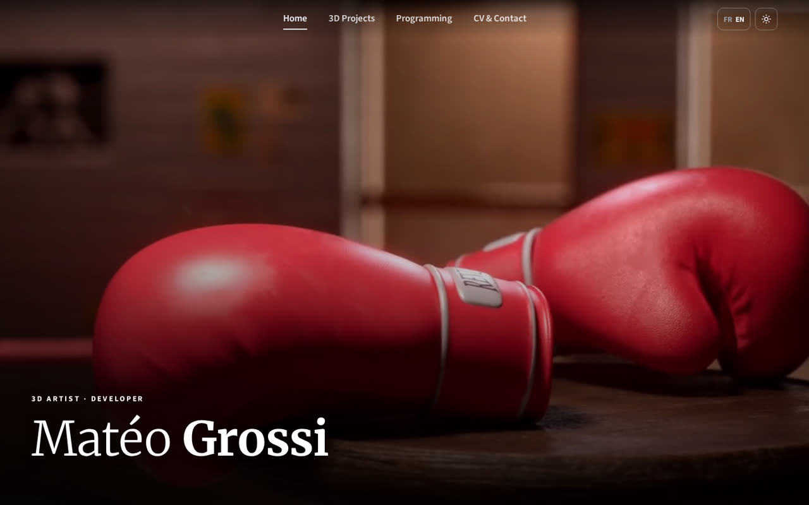
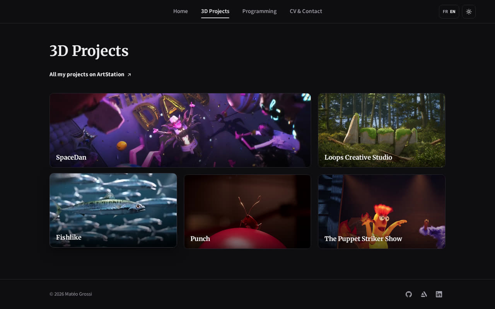
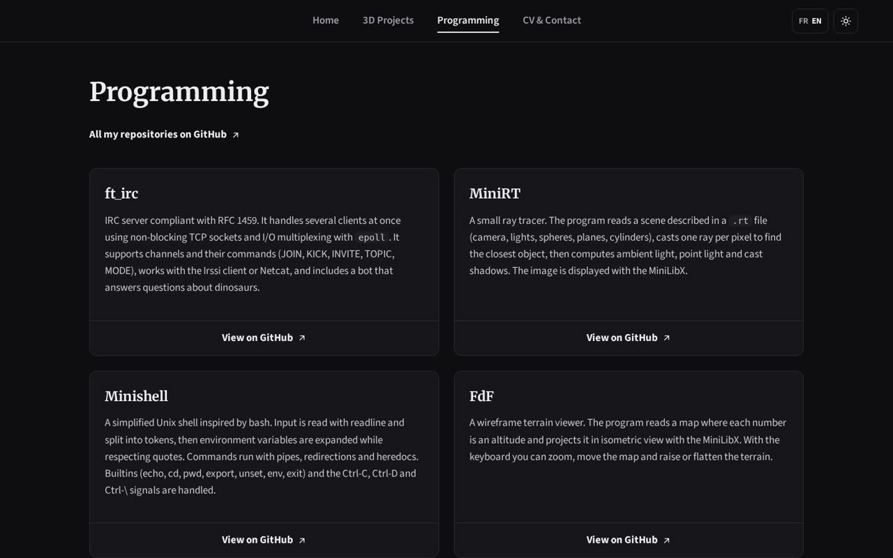
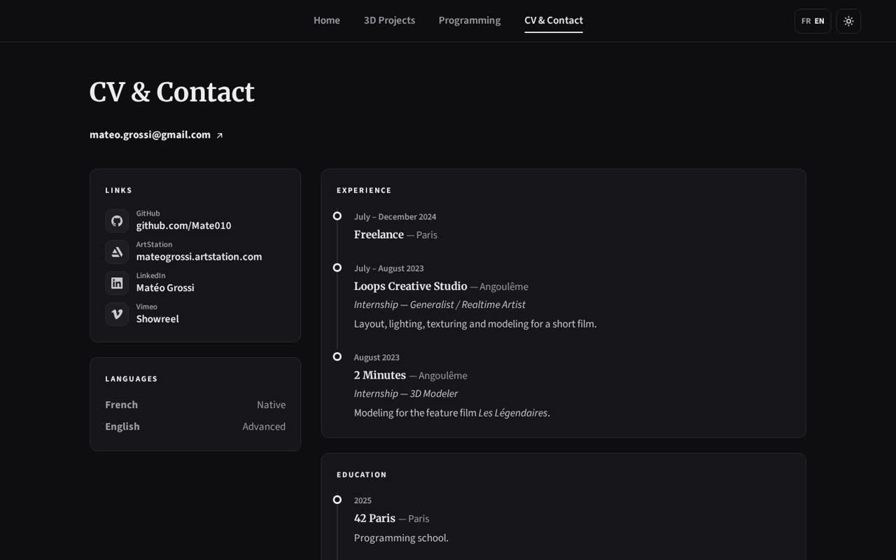
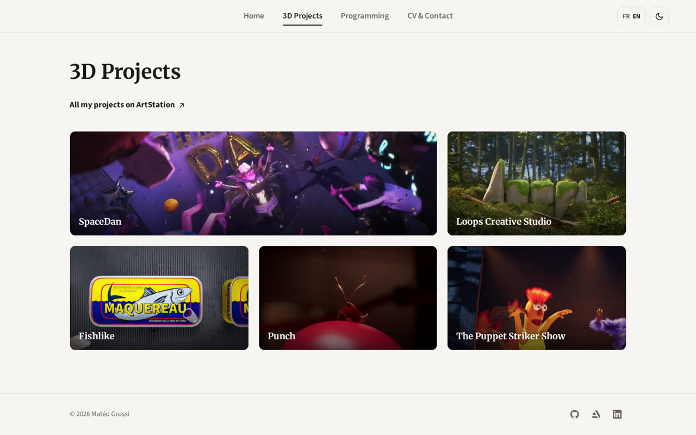

# Matéo Grossi — Portfolio

Personal portfolio of Matéo Grossi, 3D artist and developer.
A simple static website (HTML, CSS and a little JavaScript), with no framework and no build step.



## Pages

| Page | Content |
|---|---|
| **Home** (`index.html`) | Full-screen showreel playing in the background |
| **3D Projects** (`3d.html`) | Gallery of 3D projects; a short video plays when you hover a card |
| **Programming** (`code.html`) | C and C++ projects from 42 Paris, with links to GitHub |
| **CV & Contact** (`cv.html`) | Experience, education, skills and contact links |







## Features

- **French / English** — switch with the `FR EN` button; the choice is remembered.
- **Dark / light mode** — follows the system setting by default, with a toggle button.
- **Hover videos** — short MP4 clips, preloaded so they start instantly.
- **Responsive** — works on desktop, tablet and mobile.



## Run it locally

Open `index.html` in a browser. Or serve the folder:

```sh
python3 -m http.server
```

Then go to <http://localhost:8000>.

## Project structure

```
index.html, 3d.html, code.html, cv.html   the four pages
assets/css/style.css                      all styles (colours, layout, dark/light themes)
assets/js/main.js                         menu, theme, language, hover videos
assets/img/                               card images and favicon
assets/video/                             compressed videos (home background + hover clips)
assets/cv/                                CV in PDF
docs/screenshots/                         images used in this README
sources/                                  original videos (not published, ignored by git)
```

## Credits

Design, 3D work and code by Matéo Grossi.
[GitHub](https://github.com/Mate010) · [ArtStation](https://mateogrossi.artstation.com/) · [LinkedIn](https://www.linkedin.com/in/mat%C3%A9o-grossi-b2b377215/)
